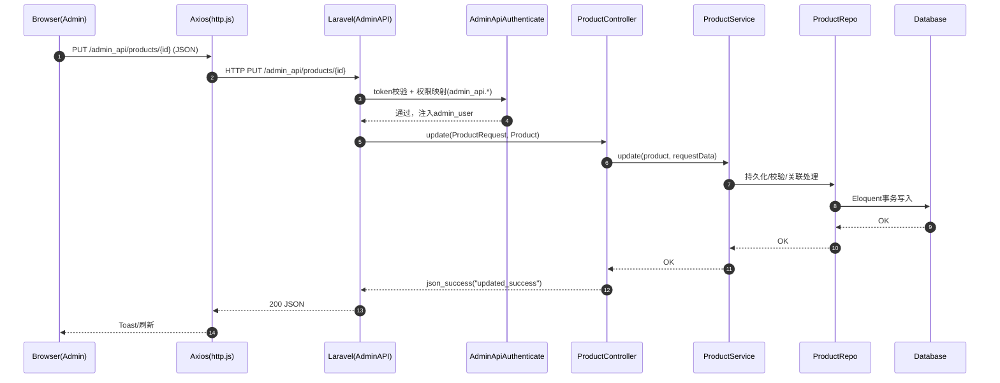
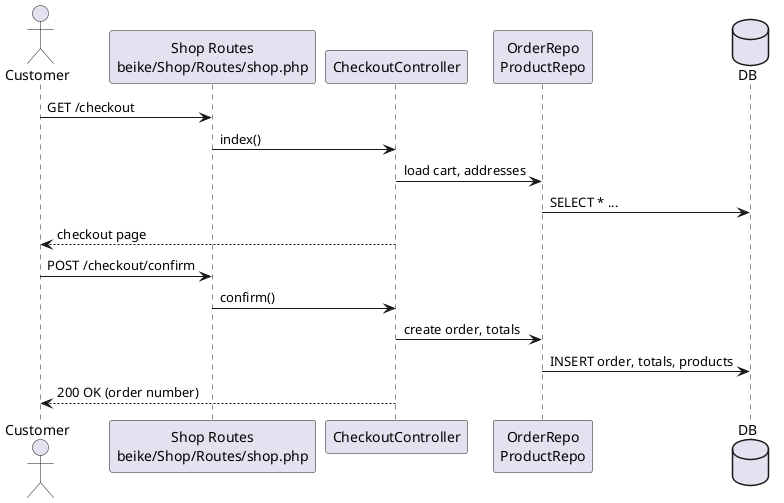
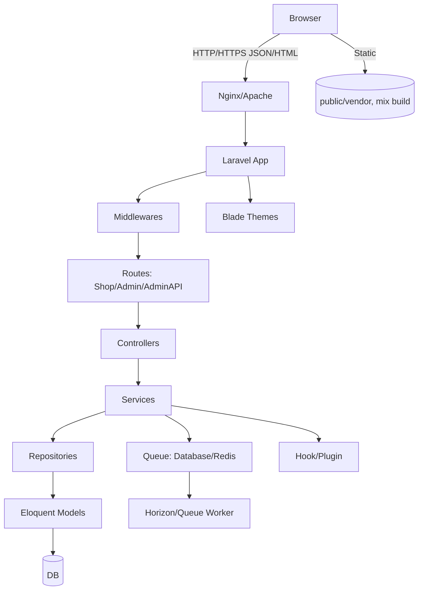

/Users/deep666666/Documents/GitHub/beikeshopOffice/docs/architecture.md
# BeikeShop Office 架构技术文档

> 项目根: `/Users/deep666666/Documents/GitHub/beikeshopOffice`  
> 技术栈: Laravel(PHP 8.1+), Eloquent ORM, Blade SSR, jQuery/Bootstrap/TinyMCE, Vue 2.7（局部增强）, Laravel Mix, Horizon（可选）, Redis/Database Queue

## 1. 前端模块分析

### 技术栈与结构
- 商城前台
  - 模板与构建: Blade 主题 `themes/default/**/*`，通过 `mix()` 引入编译产物
    - 入口模板: `themes/default/layout/master.blade.php:37` 引入 CSS/JS
  - 依赖: `public/vendor/*` 中的 `jquery`, `bootstrap`, `layer.js`, `lazysizes`
  - 资源打包: `laravel-mix`（`package.json:3–11`），源代码在 `resources/js/*` 与主题样式
- 管理后台
  - JS 入口: `resources/beike/admin/js/app.js:9`（全局挂载 `$http` 与 `bk`）
  - 样式: `resources/beike/admin/css/app.scss:14–32`
  - Blade 视图: `resources/beike/admin/views/**/*`
  - Vue 使用: 局部增强（无前端路由/状态容器）

### 路由配置与状态管理
- 前端路由: 无 SPA 前端路由，完全依赖后端路由生成页面/数据
  - 商城路由: `beike/Shop/Routes/shop.php:30`（`Route::prefix('/')...->middleware(['shop'])`）
  - 后台路由: `beike/Admin/Routes/admin.php:8`
  - 后台 API 路由: `beike/AdminAPI/Routes/api.php:16`
- 状态管理
  - 后台以 DOM + 全局对象 `bk` 管理状态
  - 统一网络层: `resources/js/http.js:11` 创建 `axiosApi`，`request()` 统一 Loading/错误处理

### 公共组件库与业务组件清单
- 管理后台 Blade 组件
  - 表单组件: `beike/Admin/View/Components/Form/*`（`Input`, `Select`, `Image`, `Textarea`, `SwitchRadio`, `InputLocale`, `RichText`）
  - 布局与通用: `beike/Admin/View/Components/*`（`Header`, `Sidebar`, `Alert`, `NoData`, `Filter`）
- 主题组件
  - 通用: `themes/default/components/*`（`breadcrumbs.blade.php`, `no-data.blade.php`）
  - 分页: `themes/default/shared/pagination/*`
  - 装修模块: `themes/default/design/*`（`product`, `tab_product`, `rich_text`, `slideshow`, 等）
- 前端工具
  - Axios 封装: `resources/js/http.js:71–109`
  - TinyMCE 初始化/文件管理器: `resources/beike/admin/js/app.js:107–151, 21–33`

### 前端模块依赖关系图
```mermaid
graph LR
  subgraph Admin Frontend
    AJS[resources/beike/admin/js/app.js] --> HTTP[resources/js/http.js]
    AJS --> jQuery
    AJS --> TinyMCE
    AJS --> ElementUI
    AJS --> LayerJS
  end

  subgraph Shop Theme
    Master[themes/default/layout/master.blade.php] --> MixCSS[mix /build/beike/shop/{theme}/css]
    Master --> MixJS[mix /build/beike/shop/{theme}/js]
    Master --> jQuery
    Master --> Bootstrap
    Master --> Lazysizes
    Master --> LayerJS
  end

  HTTP --> Axios
  MixJS --> Compiled[laravel-mix]
  MixCSS --> Compiled
```

## 2. 后端模块分析

### 分层架构
- 入口
  - Web: `public/index.php:71`（`$app = require_once ...`，`$kernel->handle(Request::capture())->send()`）
  - CLI: `artisan:20`（加载容器与控制台内核）
  - 容器与内核绑定: `bootstrap/app.php:14`（创建 `Application`），`bootstrap/app.php:29–42`（绑定 `Http/Console/ExceptionHandler`）
- 路由层
  - 商城: `beike/Shop/Routes/shop.php`
  - 后台: `beike/Admin/Routes/admin.php`
  - 后台 API: `beike/AdminAPI/Routes/api.php`
- 控制器层
  - 商城: `beike/Shop/Http/Controllers/*`
  - 后台: `beike/Admin/Http/Controllers/*`
  - 后台 API: `beike/AdminAPI/Controllers/*`
- 服务层
  - 业务服务: `beike/Services/*`（`ImageService`, `DesignService`, `SitemapService`, `QueueService`）
- 数据访问层
  - 仓库: `beike/Repositories/*`（`ProductRepo`, `CategoryRepo`, `OrderRepo` 等）
  - ORM 模型: `beike/Models/*`（Eloquent）

### 核心 API 接口与参数规范（Admin API 示例）
- 产品
  - 列表: `GET /admin_api/products` → `beike/AdminAPI/Controllers/ProductController.php:30`
    - 入参: `sort`, `page`, `filters`（Query）
    - 出参: `ProductResource[]`（分页）
  - 详情: `GET /admin_api/products/{product}` → `:49`
    - 出参: `{ product: ProductDetail, relations: ProductSimple[] }`
  - 创建: `POST /admin_api/products` → `:68`
    - 入参: `ProductRequest`（表单字段校验）
    - 出参: `json_success("created_success")`
  - 更新: `PUT /admin_api/products/{product}` → `:93`
    - 入参: `ProductRequest`
    - 出参: `json_success("updated_success")`
  - 删除: `DELETE /admin_api/products/{product}` → `:118`
    - 出参: `json_success("deleted_success")`
- 统一响应
  - `json_success/json_fail`: `beike/Helpers.php:609`

#### 请求/响应示例
- 创建商品
```json
POST /admin_api/products
{
  "name": {"en":"T-Shirt","zh_cn":"T恤"},
  "brand_id": 12,
  "images": ["/upload/xxx.jpg"],
  "skus": [{"sku":"TS-001","price":"19.99","stock":100}]
}
```
```json
200 OK
{"status":"success","message":"created_success","data":{}}
```

### 数据库表结构与 ORM 映射（节选）
- `Product` → `beike/Models/Product.php:24`
  - 关系: `categories()` 多对多, `description()` 一对一（当前 `locale()`）, `skus()` 一对多, `relations()` 多对多自关联, `brand()` 多对一
  - 软删除，`images(array)`, `variables(array)`
- `Order` → `beike/Models/Order.php:41`
  - 关系: `orderProducts`, `orderTotals`, `orderHistories`, `orderShipments`, `orderPayments`
  - 状态/通知: `getNextStatuses()`, `notifyNewOrder()`, `notifyUpdateOrder()`

### 消息队列与定时任务
- 队列
  - 默认: `config/queue.php:16` → `'database'`（`jobs`, `failed_jobs`）
  - Redis/Horizon（可选）: `config/horizon.php:167–196` Supervisor 配置，路由中间件 `['shop']`
- 定时任务
  - 调度: `app/Console/Kernel.php:21` → 每 5 分钟执行 `process:order`
  - 命令: `beike/Console/Commands/*`（`GenerateSitemap`, `FetchCurrencyRate`, `ProcessOrder`）

## 3. 模块交互分析

### 前后端通信流程（Admin API 更新商品）


### 结算流程（PlantUML）


### 数据交换格式
- 协议: HTTP/HTTPS（REST）
- 格式: JSON（统一 `status/message/data`），Blade SSR 返回 HTML

### 身份认证与权限
- 会话/CSRF
  - 全局中间件: `app/Http/Kernel.php:16`（`EncryptCookies`, `StartSession`, `VerifyCsrfToken` 等）
- 商城认证
  - `ShopAuthenticate`: `app/Http/Middleware/ShopAuthenticate.php:23`（校验 `Customer` 活跃与状态）
- 后台 API Token
  - `AdminApiAuthenticate`: `app/Http/Middleware/AdminApiAuthenticate.php:31`（`token` 校验与路由权限映射）

### 强/弱依赖
- 强依赖
  - 控制器 → 服务 → 仓库 → 模型
  - 中间件 → 认证/权限
  - 主题 Blade → 设置/语言/货币
- 弱依赖
  - Hook 系统（`hook_filter/hook_action`）→ 插件扩展
  - 队列后端可切换（Database/Redis）

## 4. 架构示意图


## 5. 模块功能说明（含 I/O 示例）

- 商品搜索（商城）
  - 路由: `GET /products/search` → `beike/Shop/Routes/shop.php:66`
  - 输入: `q`(关键词), `filters`(价格/类目), `page`
  - 输出: Blade HTML（SSR）；必要时 JSON（异步）
- 下单与结算（商城）
  - 路由: `GET /checkout`/`POST /checkout/confirm` → `beike/Shop/Routes/shop.php:83`
  - 输入: 地址/配送/支付/购物车
  - 输出: 成功页或错误（HTML/JSON）
- 后台商品管理（Admin）
  - 路由: `GET /{admin}/products` 页面，`/admin_api/products` API
  - 输入: 表单字段（名称、描述、图片、SKU）
  - 输出: 页面渲染或 `json_success/json_fail`

## 6. 技术选型与依据
- Laravel + Eloquent：生态成熟、生产力高、ORM 简化数据访问
- Blade SSR + jQuery/Bootstrap：SEO与首屏体验好，后台页面开发效率高
- Vue 2.7（局部增强）：复杂交互可维护性提升
- 队列与调度：默认 Database 简单易用，生产可切 Redis + Horizon
- Hook/Plugin：弱耦合扩展机制，支持插件与埋点

## 7. QPS 指标与性能建议（初始规划）
- 商城页面（SSR）
  - 首页: 100 QPS；商品详情: 150 QPS；搜索: 80 QPS；结算链路: 50 QPS
- 后台 API
  - 读: 50 QPS；写: 20 QPS
- 队列任务
  - 订单处理: 10 jobs/s（Horizon 可扩容）
- 建议
  - 缓存/索引优化，CDN 前置静态；Redis 队列 + Horizon 监控；避免 N+1

## 8. 已知问题与技术债务
- 前端技术混用（jQuery + Vue），无集中状态容器，复杂交互维护成本高
- 第三方库直接 `<script>` 引入（`public/vendor`），版本管理需统一
- 队列默认 `database`，高并发需切 Redis 并启用 Horizon
- Admin API Token 自定义，建议长期采用 OAuth2/JWT 规范
- 语言与 URI 重写（`Beike\Libraries\Request`）与反代/Rewrite 组合需谨慎
- 插件机制缺少统一版本策略与隔离

## 9. 关键代码片段引用
- Web 入口: `public/index.php:71`
- 容器与内核绑定: `bootstrap/app.php:14`, `bootstrap/app.php:29`
- 中间件栈: `app/Http/Kernel.php:16`, `app/Http/Kernel.php:30`
- Admin API 认证: `app/Http/Middleware/AdminApiAuthenticate.php:31`, `:71`
- 商品模型: `beike/Models/Product.php:24`
- 订单模型与通知: `beike/Models/Order.php:41`, `:139`
- 队列配置与调度: `config/queue.php:16`, `app/Console/Kernel.php:21`
- 统一 JSON 响应: `beike/Helpers.php:609`

---